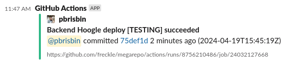

# Slack Notify

<!-- action-docs-header source="action.yml" -->

<!-- action-docs-header source="action.yml" -->

<!-- action-docs-description source="action.yml" -->

## Description

Minimal inputs action to notify Slack of Job status

<!-- action-docs-description source="action.yml" -->

## Features

1. Reasonable defaults, only one required input
1. Tidy message format, erring on unobtrusiveness
1. Default title and color based on workflow, job, and status
1. Includes commit details and URL to the run
1. Maps GitHub users to Slack users (requires configuration)



<!-- action-docs-inputs source="action.yml" -->

## Inputs

| name                | description                                                                                                                                                                                                                                                                                                           | required | default                                                     |
| ------------------- | --------------------------------------------------------------------------------------------------------------------------------------------------------------------------------------------------------------------------------------------------------------------------------------------------------------------- | -------- | ----------------------------------------------------------- |
| `slack-webhook-url` | <p>Slack webhook url, typically a repository secret.</p>                                                                                                                                                                                                                                                              | `true`   | `""`                                                        |
| `slack-channel`     | <p>Explicit channel for this notification. If omitted (the default), the channel configured in the webhook is used.</p>                                                                                                                                                                                               | `false`  | `""`                                                        |
| `event-name`        | <p>A name for the event being notified about. If not given, the workflow and job id is used.</p>                                                                                                                                                                                                                      | `false`  | `""`                                                        |
| `message`           | <p>Additional content to add to the message. Details about the commit that triggered the Job in which this step is run are always included.</p>                                                                                                                                                                       | `false`  | `""`                                                        |
| `commit-sha`        | <p>Commit SHA to fetch details for. Default is the PR head sha or github.sha if not in the context of a PR.</p>                                                                                                                                                                                                       | `false`  | `${{ github.event.pull_request.head.sha \|\| github.sha }}` |
| `slack-users`       | <p>A JSON object (as a string in the Yaml) mapping GitHub usernames to Slack User Ids (e.g. UXXXXXX). If present, the commit author is looked up in the map and the Slack user, if found, is at-mentioned in the notification details. If a Slack user is not found, an error is generated as a build annotation.</p> | `false`  | `""`                                                        |
| `slack-users-file`  | <p>Relative path within the repository to read the slack-users JSON from a file. The file is read from the default branch via the API.</p>                                                                                                                                                                            | `false`  | `""`                                                        |
| `github-token`      |                                                                                                                                                                                                                                                                                                                       | `false`  | `${{ github.token }}`                                       |
| `dry-run`           | <p>Don't actually notify (useful for testing)</p>                                                                                                                                                                                                                                                                     | `false`  | `false`                                                     |

<!-- action-docs-inputs source="action.yml" -->

<!-- action-docs-outputs source="action.yml" -->

<!-- action-docs-outputs source="action.yml" -->

<!-- action-docs-usage action="action.yml" project="freckle/slack-notify-action" version="v1" -->

## Usage

```yaml
- uses: freckle/slack-notify-action@v1
  with:
    slack-webhook-url:
    # Slack webhook url, typically a repository secret.
    #
    # Required: true
    # Default: ""

    slack-channel:
    # Explicit channel for this notification. If omitted (the default), the
    # channel configured in the webhook is used.
    #
    # Required: false
    # Default: ""

    event-name:
    # A name for the event being notified about. If not given, the
    # workflow and job id is used.
    #
    # Required: false
    # Default: ""

    message:
    # Additional content to add to the message. Details about the commit that
    # triggered the Job in which this step is run are always included.
    #
    # Required: false
    # Default: ""

    commit-sha:
    # Commit SHA to fetch details for. Default is the PR head sha or github.sha
    # if not in the context of a PR.
    #
    # Required: false
    # Default: ${{ github.event.pull_request.head.sha \|\| github.sha }}

    slack-users:
    # A JSON object (as a string in the Yaml) mapping GitHub usernames to Slack
    # User Ids (e.g. UXXXXXX). If present, the commit author is looked up in the
    # map and the Slack user, if found, is at-mentioned in the notification
    # details. If a Slack user is not found, an error is generated as a build
    # annotation.
    #
    # Required: false
    # Default: ""

    slack-users-file:
    # Relative path within the repository to read the slack-users JSON from a
    # file. The file is read from the default branch via the API.
    #
    # Required: false
    # Default: ""

    github-token:
    #
    # Required: false
    # Default: ${{ github.token }}

    dry-run:
    # Don't actually notify (useful for testing)
    #
    # Required: false
    # Default: false
```

<!-- action-docs-usage action="action.yml" project="freckle/slack-notify-action" version="v1" -->

## Slack Users

If told the mapping from GitHub Username to Slack User Id, this action will
at-mention the author of the commit in which the Job is running:

```yaml
- uses: freckle/slack-notify-action@v1
  with:
    slack-webhook: ${{ secrets.SLACK_WEBHOOK }}
    slack-users: |
      {
        "octocat": "UXXXXXX",
        "pbrisbin": "UXXXXXX"
      }
```

If this content gets too big, you can store it in the repository instead:

```yaml
- uses: freckle/slack-notify-action@v1
  with
    slack-webhook: ${{ secrets.SLACK_WEBHOOK }}
    slack-users-file: .github/slack.json
```

The file is read from the default branch using the API (so no checkout is
required.)

## Release

TODO
